# Mongo Debugger

**AI-powered MongoDB FTDC analyzer** — upload `diagnostic.data`, run deterministic analysis with [simagix/mongo-ftdc](https://github.com/simagix/mongo-ftdc), optionally parse **MongoDB logs with Hatchet**, store metrics in **Postgres**, then generate **agentic root-cause reports** via a 3-phase LLM workflow (Cursor SDK / Gemini ADK + MCP evidence tools).

```text
Browser → ui nginx (:8000) → api FastAPI (ClusterIP)
Upload → Postgres job queue → worker (baked Go binaries)
     → tiered evidence + metrics COPY into Postgres
     → optional Hatchet log parse → summary.json
     → SPA /runs/{id}: Decoding → Ready → Phase A/B/C RCA
     → JSON/HTML report + chatbot + Grafana SimpleJSON charts
```

**Status:** [docs/PROJECT_STATUS.md](docs/PROJECT_STATUS.md) · **Changelog:** [docs/CHANGELOG.md](docs/CHANGELOG.md) · **Docs hub:** [docs/README.md](docs/README.md)

---

## Features

| Area | What you get |
|------|----------------|
| **Deterministic lab** | mongo-ftdc diagnosis, assessment scores, anomaly windows, tiered LLM export |
| **Modern SPA** | Vite React shell + stitch iframes; upload, runs catalog, RCA workspace, MCP/Skill WorkAreas |
| **Kind / Helm stack** | **ui** nginx NodePort, **api** ClusterIP (JSON-only), **worker**, **postgres** (PVC), **grafana** |
| **MongoDB logs (Hatchet)** | Optional `mongod.log` upload on the run page → `summary.json`; Phase 2 waits when logs present |
| **Agentic RCA** | Investigation → clarifying questions → final report with citations |
| **Post-report chatbot** | Agentic follow-up (markdown, mermaid, copy); disk transcript + summarize/replay memory |
| **Multi-LLM** | Per-slot artifacts (`cursor`, `gemini`, `mock`); switch LLM without cross-contamination |
| **Evidence-first** | Tier-1 findings authoritative; LLM fetches metric slices via MCP, not raw dumps |
| **Metric charts in reports** | LLM authors a matplotlib script; it runs in a **Daytona sandbox** (CSV in → PNG out, no DB/network); chart embedded in Report tab and downloadable HTML |
| **Grafana charts** | Helm Grafana + SimpleJSON over Postgres (`/grafana/simple`); Anomaly View + All Metrics |
| **Operator WorkAreas** | MCP connectors + skill ZIP catalog; run-page MCP checkboxes; skills auto-attach |

---

## Architecture (runtime)

Same layout style as the Latency Dashboard: **UI nginx is the sole entry**, API and worker are separate pods, durable state is Postgres. Deterministic Phase 1 runs on the **worker**; Phase 2 reasoning runs on the **API** (Cursor SDK or Gemini ADK). For both LLM slots, **MCP stdio servers are subprocesses on the API pod** — vendor clouds are model-only.

Grafana NodePort `:3030` is **Kind playground only**, not a production exposure pattern.

```mermaid
%%{init: {'flowchart': {'nodeSpacing': 85, 'rankSpacing': 120}, 'themeVariables': {'fontSize': '16px'}}}%%
flowchart LR
  Operator(["User / operator"])

  subgraph browser [Browser]
    Web["Modern SPA + stitch | upload | /runs/id catalog gate | RCA | WorkAreas"]
  end

  subgraph uiPod [UI Pod — nginx]
    Nginx["nginx | Vite SPA + /static | proxy /simagix /docs /health → api"]
  end

  subgraph apiPod [API Pod — FastAPI]
    FastAPI["FastAPI workers=1 | upload enqueue | catalog JSON | SimpleJSON"]
    Phase2API["Phase 2 HTTP | investigate | clarify | RCA | chatbot"]
    Pool["phase2 ThreadPoolExecutor | max_workers=4"]
    Specs["build_mcp_server_specs | same list for cursor and gemini"]
    Provider["LLMProvider | cursor or gemini or mock"]

    subgraph agentRuntime [Agent runtime in this pod]
      CursorSDK["Cursor SDK | Agent.create + tool loop"]
      ADK["Gemini ADK | InMemoryRunner + McpToolset"]
    end

    subgraph mcpLocal [MCP stdio — always local to API pod]
      McpChild["subprocess python -m … | simagix-evidence | hatchet | graylog | WorkArea stdio | execute_plot_script"]
    end

    subgraph modelCloud [Vendor cloud — model only]
      Cloud["Cursor Cloud or Gemini API | tokens in/out | never spawns MCP | never opens Postgres"]
    end
  end

  subgraph workerPod [Worker Pod — Phase 1]
    Poll["1 replica v1 | poll Postgres jobs | one job at a time"]
    Decode["subprocess llm-export / mongo-ftdc"]
    HatchetJob["subprocess Hatchet when logs uploaded"]
    Ingest["ingest COPY metrics + evidence → Postgres"]
  end

  subgraph pgPod [Postgres Pod]
    PG[("Postgres + PVC | jobs | metrics | evidence | charts | skills | MCP registry")]
  end

  subgraph daytona [Daytona — ephemeral microVM]
    Sandbox["sandbox | data.csv in → matplotlib script → chart.png out | no DB creds | no cluster net"]
  end

  subgraph k8s [Kubernetes deploy]
    Helm["Helm mongo-debugger | ui api worker postgres"]
    Secret["Secret | DB password | CURSOR_API_KEY | GEMINI_API_KEY | DAYTONA_API_KEY"]
  end

  Operator --> Web --> Nginx -->|"proxy /simagix/*"| FastAPI
  FastAPI --> Phase2API --> Pool --> Provider
  Provider --> CursorSDK
  Provider --> ADK
  Provider --> Specs
  Specs -->|"Cursor: AgentOptions.mcp_servers"| McpChild
  Specs -->|"Gemini: to_adk_mcp_toolsets StdioConnectionParams"| McpChild
  CursorSDK <-->|"tool calls / model text"| Cloud
  ADK <-->|"tool calls / model text"| Cloud
  McpChild -->|"SELECT slices / tier-1"| PG
  McpChild -->|"CSV in / PNG out"| Sandbox
  McpChild -->|"store chart PNG"| PG

  FastAPI -->|"INSERT pending job"| PG
  Poll -->|"claim job"| PG
  Poll --> Decode --> Ingest --> PG
  Poll --> HatchetJob --> Ingest

  Helm --> uiPod
  Helm --> apiPod
  Helm --> workerPod
  Helm --> pgPod
  Secret --> FastAPI
  Secret --> Poll
  Secret --> PG

  FastAPI -.->|"never runs Phase 1 decode"| workerPod
  Cloud -.->|"never runs MCP"| McpChild
  Sandbox -.->|"never runs inside a pod"| apiPod
```



| Subgraph | Role |
|----------|------|
| **Browser / UI pod** | SPA shell; nginx sole entry; proxies API |
| **API pod** | JSON API, Phase 2 agents, MCP stdio children, catalog gate |
| **Worker pod** | Phase 1 only — one job at a time; decode/Hatchet subprocess + ingest |
| **Postgres pod** | Durable jobs, metrics, skills, MCP registry, report chart PNGs |
| **Daytona sandbox** | Ephemeral microVM for LLM-authored matplotlib — CSV in, PNG out; no pod/cluster access |
| **Vendor cloud** | Model tokens only — does not spawn MCP or open Postgres |
| **Kubernetes deploy** | Helm + secrets (incl. `DAYTONA_API_KEY`) |

| Provider | Tool loop | MCP process |
|----------|-----------|-------------|
| **Cursor** | SDK in API pod | stdio **subprocess on API pod** |
| **Gemini** | ADK in API pod | same specs → **stdio subprocess on API pod** |
| **Either cloud** | model only | does **not** run MCP |

HTTP WorkArea connectors call a remote URL from the API pod (not a local subprocess). Phase 2 concurrency is `ThreadPoolExecutor(max_workers=4)` on the API — separate from Phase 1 worker replicas.

**LLM-authored code never runs inside a pod.** When the LLM calls the `execute_plot_script` MCP tool, the API pod fetches the metric series, pushes a CSV to an ephemeral **Daytona microVM sandbox**, runs the LLM-written matplotlib script there, pulls back `chart.png`, then deletes the sandbox. The sandbox has no database credentials and no network access — it receives only a CSV and returns only a PNG.

### Ports (Kind demo)

| What | How you reach it |
|------|------------------|
| **App UI + API proxy** | **http://localhost:8000** → NodePort `30000` (`deploy/kind/cluster.yaml`) |
| **Grafana (optional playground)** | **http://localhost:3030** or `kubectl port-forward svc/grafana 3030:3000` — not a prod exposure pattern |
| **API inside cluster** | `http://api:8000` (ClusterIP — not on localhost) |

### Layer map

| Layer | Role |
|-------|------|
| **ui nginx** | Serves SPA + stitch assets; sole browser entry; proxies API paths |
| **api** | Upload, catalog, Phase 2, SimpleJSON; hosts Cursor/ADK + MCP children |
| **worker** | Claims jobs; baked `llm-export` / Hatchet subprocess; ingests metrics |
| **Postgres (+ PVC)** | Durable jobs, FTDC metrics, chart PNGs, operator skills/MCP registry |
| **Cursor SDK / Gemini ADK** | Agent runtime in API pod; shared `build_mcp_server_specs` |
| **Daytona sandbox** | Runs `execute_plot_script` matplotlib outside the cluster |
| **Phase 2** | Investigate → clarify once → final RCA → chatbot |
| **Grafana** | Optional charts over Postgres SimpleJSON |

**Excalidraw (older lane diagram):** [docs/mongo-debugger-runtime-flow.excalidraw.json](docs/mongo-debugger-runtime-flow.excalidraw.json) — still useful for storytelling; pod diagram above is current.

Deep dive: [docs/ARCHITECTURE.md](docs/ARCHITECTURE.md) · [docs/PRODUCTION_ARCHITECTURE.md](docs/PRODUCTION_ARCHITECTURE.md) · Tradeoffs: [docs/DESIGN_NOTES.md](docs/DESIGN_NOTES.md) §14

---

## Quick start — Kind (recommended for full stack)

### 1. Prerequisites

- Docker (Colima on Mac recommended)
- [Kind](https://kind.sigs.k8s.io/) + `kubectl` + [Helm](https://helm.sh/)
- Enough RAM (8 GB+ Colima / Docker Desktop)

```bash
brew install docker docker-compose colima kind kubectl helm
colima start --cpu 4 --memory 8 --disk 60
```

### 2. Create Kind cluster (with port maps)

```bash
cd mongo-debugger   # repo root
kind create cluster --name mongo-debugger --config deploy/kind/cluster.yaml
```

This maps **8000→30000** (ui) and **3030→30300** (Grafana). If Grafana is unreachable on `:3030`, the cluster was likely created without this config — use port-forward (below) or recreate.

### 3. Build images, load, Helm install

```bash
./deploy/scripts/load-images.sh
helm upgrade --install mongo-debugger deploy/helm \
  --set postgres.password=password \
  -f deploy/values-local.yaml \
  --wait --timeout 10m
kubectl get pods -l 'app in (ui,api,worker,postgres,grafana)'
```

Open **http://localhost:8000**.

Optional Grafana check:

```bash
curl -sS http://localhost:3030/api/health || kubectl port-forward svc/grafana 3030:3000
# admin / admin
```

### 4. Typical operator flow

1. **Upload** → `http://localhost:8000/upload` (zip of `diagnostic.data` or `metrics.*`)
2. Redirect to **`/runs/{run_id}`** — SPA shows **Decoding** / **Loading metrics** until Phase 1 succeeds
3. **Run RCA** (Mock works without keys; Cursor/Gemini need `.env` / secrets in Helm)
4. Optional: **MCP WorkArea** / **Skill WorkArea**; enable MCP checkboxes on the run page
5. **Grafana** links on Evidence tab (time range from capture window)

### 5. Rebuild after code changes

```bash
./deploy/scripts/load-images.sh
kubectl rollout restart deploy/ui deploy/api deploy/worker
kubectl rollout status deploy/ui deploy/api deploy/worker --timeout=180s
```

UI-only (spinner / SPA copy):

```bash
docker build -f deploy/docker/Dockerfile.ui -t mongo-debugger-ui:latest .
kind load docker-image mongo-debugger-ui:latest --name mongo-debugger
kubectl rollout restart deploy/ui
```

Postgres stuck / catalog 500 — see [docs/OPERATIONS.md](docs/OPERATIONS.md) § Catalog / Postgres CrashLoop.

---

## Quick start — local uv (API + worker on host)

Use this for fast backend iteration without Kind. Pipeline still needs Docker for decode unless you use Kind’s worker image pattern.

### 1. Install

```bash
git clone https://github.com/Prateek-Agarwal2006/Mongo-Debugger.git mongo-debugger
cd mongo-debugger
uv python install 3.11
uv sync --extra dev --extra llm
cp .env.example .env   # CURSOR_API_KEY / GEMINI_API_KEY optional
```

### 2. Simagix toolchain (Docker images for pipeline)

```bash
# Kind builds use vendored simagix-workspace/repos/mongo-ftdc (incl. ftdc-slice).
# Optional: hatchet/keyhole clones + local Docker tags for Grafana/logs:
./scripts/setup-simagix-repos.sh
cd simagix-workspace/repos/mongo-ftdc && ./build.sh docker && cd -
```

### 3. Postgres

Local Mode expects `DATABASE_URL` (see `.env.example`). Kind already runs Postgres in-cluster.

### 4. Two processes

```bash
colima start --cpu 4 --memory 8

# Terminal 1 — API (JSON + SPA assets if you serve them; Kind UI image is preferred for Modern SPA)
uv run uvicorn backend.app.main:app --reload --port 8000

# Terminal 2 — worker
uv run python -m backend.app.jobs.worker
```

Build SPA for local static serving when developing UI:

```bash
cd frontend && npm install && npm run build && cd -
```

**Mock RCA:** select **Mock** on the run page (no API key).

### 5. Tests

```bash
uv run pytest backend/tests -q
./scripts/demo.sh   # needs server on :8000
```

---

## Repository layout

```text
backend/app/                 FastAPI, Phase 2 LLM, jobs, catalog, SimpleJSON Grafana
frontend/                    Vite SPA (src/) + stitch HTML/JS/CSS (static/)
deploy/
  kind/cluster.yaml          Kind ports 8000 + 3030
  helm/                      ui · api · worker · postgres · grafana
  docker/                    Dockerfile.ui · Dockerfile.api · Dockerfile.worker
  scripts/load-images.sh     Build + kind load
docs/                        Full documentation (hub: docs/README.md)
scripts/                     demo.sh, setup-simagix-repos.sh
simagix-workspace/
  uploads/<run_id>/          inputs · phase1 · phase2
  operator/                  sample MCP test servers + mongo-rca-playbook skill
  scripts/                   pipeline wrappers (Kind uses baked binaries in worker)
```

---

## Configuration (high signal)

| Variable | Purpose |
|----------|---------|
| `DATABASE_URL` | Postgres (required for catalog, jobs, metrics, skills) |
| `DATA_ROOT` | Workspace root (Kind: `/data`; local: repo root) |
| `CURSOR_API_KEY` / `CURSOR_MODEL` | Live Cursor Phase 2 |
| `GEMINI_API_KEY` | Optional Gemini ADK slot |
| `DAYTONA_API_KEY` | Sandbox for LLM-authored matplotlib charts (get at daytona.io) |
| `PHASE2_*_MAX_TOOL_CALLS` | MCP budget per phase |
| `PHASE2_CHATBOT_*` | Chatbot memory window |
| `PHASE2_WEB_FETCH_*` | Trusted HTTPS `web_fetch` policy |
| `GRAFANA_URL` | Browser Grafana URL (default `http://localhost:3030`) |

Full list: [.env.example](.env.example) · [docs/OPERATIONS.md](docs/OPERATIONS.md)

---

## Operator tips (Kind)

| Symptom | Fix |
|---------|-----|
| **Catalog / Database unavailable** | Postgres CrashLoop or recovering — [OPERATIONS](docs/OPERATIONS.md); wait or wipe PVC |
| **Grafana won’t open on :3030** | Kind missing port map → `kubectl port-forward svc/grafana 3030:3000` |
| **Upload sits on Decoding** | Check `kubectl logs deploy/worker`; ensure Postgres Ready |
| **Double upload** | Busy spinner disables submit; wait for POST to finish before expecting `/runs/{id}` |
| **Skill ZIP** | Upload at `/skill-workarea`; stored in **Postgres** (zip not kept on disk) |
| **Test MCP on Kind** | Prefer HTTPS echo MCP; host `127.0.0.1` / `test-ping-mcp` need files/`uv` not in API image |

---

## Documentation

| Doc | Description |
|-----|-------------|
| [**docs/README.md**](docs/README.md) | Documentation hub |
| [ARCHITECTURE.md](docs/ARCHITECTURE.md) | System map + zoom diagrams |
| [PRODUCTION_ARCHITECTURE.md](docs/PRODUCTION_ARCHITECTURE.md) | K8s decisions (Postgres-only, baked binaries, …) |
| [OPERATIONS.md](docs/OPERATIONS.md) | Kind rebuild, upload, Grafana, Postgres probes |
| [PHASE2_LLM.md](docs/PHASE2_LLM.md) | Cursor / ADK, MCP, 3-phase RCA, WorkAreas |
| [RCA_BACKEND.md](docs/RCA_BACKEND.md) | REST + catalog API |
| [DESIGN_NOTES.md](docs/DESIGN_NOTES.md) | Demo / interview · **§14 tradeoffs** |
| [export_contract.md](docs/export_contract.md) | Evidence bundle schema |

**Contributors / agents:** [AGENTS.md](AGENTS.md) · [docs/DOC_MAINTENANCE.md](docs/DOC_MAINTENANCE.md)

---

## License

Intern project — see repository owner for licensing. Upstream Simagix tools have their own licenses in `simagix-workspace/repos/`.
