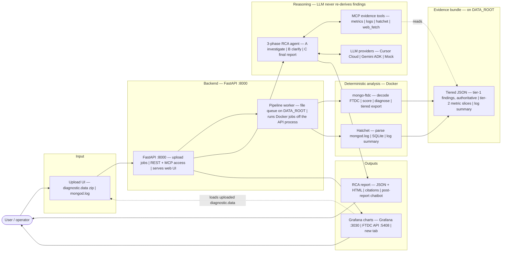
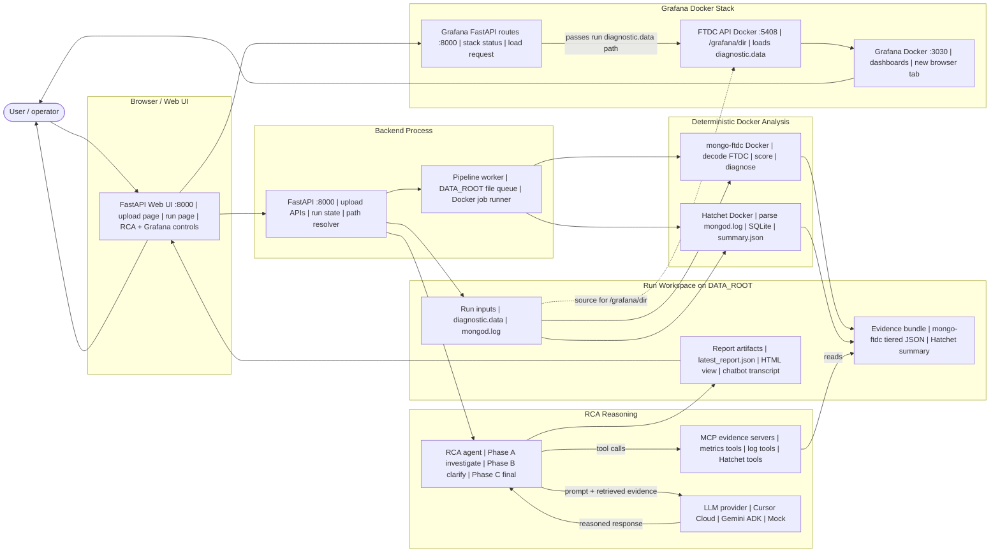

# Mongo Debugger

**AI-powered MongoDB FTDC analyzer** — upload `diagnostic.data`, run deterministic analysis with [simagix/mongo-ftdc](https://github.com/simagix/mongo-ftdc), optionally parse **MongoDB logs with Hatchet**, then generate **agentic root-cause reports** via a 3-phase LLM workflow (Cursor SDK + MCP evidence tools).

```text
Upload → pipeline worker (Docker) → tiered evidence bundle → Web UI + FastAPI
       → optional Hatchet log parse → summary.json for Phase 2
       → Phase A: investigate (MCP) → Phase B: clarify → Phase C: final RCA
       → JSON/HTML report + post-report chatbot + Grafana charts (new tab)
```

---

## Features

| Area | What you get |
|------|----------------|
| **Deterministic lab** | mongo-ftdc diagnosis, assessment scores, anomaly windows, tiered LLM export |
| **Web app** | Upload `.zip`/`.tar.gz`, browse runs, RCA panel, Grafana dashboard links, post-report chatbot |
| **MongoDB logs (Hatchet)** | Optional `mongod.log` upload on the run page; Docker parse → `summary.json`; Phase 2 waits when logs present |
| **Agentic RCA** | Investigation → up to 10 clarifying questions → final report with citations |
| **Post-report chatbot** | Agentic follow-up per message (markdown, mermaid, copy); disk transcript + summarize/replay memory |
| **Multi-LLM** | Per-slot artifacts (`cursor`, `gemini`, `mock`); switch LLM in the run UI without cross-contamination |
| **Evidence-first** | Tier-1 findings are authoritative; LLM fetches metric slices via MCP, not raw dumps |
| **Grafana charts** | Shared Docker stack (`:3030` / `:5408`); first visit auto-loads FTDC; reload keeps dashboard links visible |
| **Optional signals** | Profiler upload, Graylog MCP, Hatchet tier-2 MCP tools, trusted HTTPS `web_fetch` |

**Status:** [docs/PROJECT_STATUS.md](docs/PROJECT_STATUS.md) · **Changelog:** [docs/CHANGELOG.md](docs/CHANGELOG.md)

---

## Quick start

### 1. Prerequisites

- **macOS or Linux**
- [Docker](https://docs.docker.com/get-docker/) — on Mac, [Colima](https://github.com/abiosoft/colima) is recommended
- **Python 3.11** and [uv](https://docs.astral.sh/uv/)

```bash
brew install docker docker-compose colima   # Mac
colima start --cpu 4 --memory 8 --disk 60
uv python install 3.11
```

### 2. Clone and install

```bash
git clone https://github.com/Prateek-Agarwal2006/Mongo-Debugger.git mongo-debugger
cd mongo-debugger
uv sync --extra dev --extra llm
cp .env.example .env   # optional: set CURSOR_API_KEY for live Phase 2
```

### 3. Simagix toolchain (Docker pipeline)

```bash
./scripts/setup-simagix-repos.sh
cd simagix-workspace/repos/mongo-ftdc && ./build.sh docker && cd -
```

This builds the `simagix/ftdc` image used by the upload pipeline. For Grafana charts, also build the patched local FTDC server image once:

```bash
simagix-workspace/scripts/build-ftdc-local.sh
```

### 4. Run the app (two processes)

```bash
colima start --cpu 4 --memory 8   # if not already running

# Terminal 1 — API + web UI
uv run uvicorn backend.app.main:app --reload --port 8000

# Terminal 2 — pipeline worker (upload decode + Hatchet jobs)
uv run python -m backend.app.jobs.worker
```

Open **http://localhost:8000** → **Upload** or browse the included test run `phase1test20260609T133314Z`.

### 5. Grafana charts (optional)

```bash
./simagix-workspace/scripts/run-grafana-stack.sh
```

On a run page, FTDC loads automatically on first visit; open **Anomaly View** or **All Metrics** in a new tab. See [docs/OPERATIONS.md](docs/OPERATIONS.md) for troubleshooting (reload during decode, empty panels).

### 6. Tests and demo

```bash
uv run pytest backend/tests -q
./scripts/demo.sh   # requires server on :8000
```

**Mock RCA** (no API key): select **Mock** in the LLM dropdown on the run page, or pass `{"llm":"mock"}` to Phase 2 APIs.

---

## Architecture (30 seconds)

The system deliberately splits **deterministic analysis** (Docker tools find the health issues) from **reasoning** (the LLM only explains and correlates) — so the agent never re-derives findings from raw metrics.



Ports: **FastAPI** `:8000` (the only thing the browser talks to) · **Grafana** `:3030` and **FTDC API** `:5408` (shared Docker stack, opened in a new tab). LLM providers are external (Cursor Cloud, Gemini).

### Mentor/Manager Flow (Concrete Runtime)

This second view keeps the same story but makes three runtime details explicit: **Grafana is also Docker**, the **RCA agent calls MCP tools** while the LLM provider only returns model output, and Grafana loads the run's uploaded `diagnostic.data` path through the FTDC API rather than reading the evidence bundle.



Key read: **the LLM provider does not call MCP directly**. The RCA agent controls the loop, asks MCP servers for evidence, sends the selected evidence to the provider, and writes the report. Grafana is separate from Phase 2 RCA: its Docker FTDC API loads the run's uploaded `diagnostic.data` for charts.

**Excalidraw (clean lane view):** [docs/mongo-debugger-mentor-flow.excalidraw.json](docs/mongo-debugger-mentor-flow.excalidraw.json) — open in Excalidraw or reload via Excalidraw MCP session `mongo-debugger-mentor-clean`.

| Layer | Role |
|-------|------|
| **mongo-ftdc** (Docker) | Decode FTDC, score, diagnose, export tiered bundle |
| **Hatchet** (Docker) | Parse `mongod.log` → SQLite → compact tier-1 summary for Phase 2 |
| **Pipeline worker** | File queue on `DATA_ROOT`; runs mongo-ftdc + Hatchet jobs outside the API process |
| **FastAPI backend** | Upload jobs, REST/MCP evidence access, web UI |
| **Cursor SDK** | Agent runtime — tool loop (ReAct); we implement MCP **servers** only |
| **Gemini ADK** | Second LLM slot with shared evidence tools + `web_fetch` policy |
| **Grafana stack** | Shared `mongo-debugger/ftdc:local` + Grafana; per-run load via `/grafana/dir` |
| **Phase 2** | 3-step RCA: investigate → ask operator once → final report → chatbot |

Deep dive: [docs/ARCHITECTURE.md](docs/ARCHITECTURE.md) · Design rationale & mentor Q&A: [docs/DESIGN_NOTES.md](docs/DESIGN_NOTES.md) (§13 code walkthrough, §14 tradeoffs)

---

## Repository layout

```text
backend/app/              FastAPI, Phase 2 LLM, Grafana, Hatchet jobs, web route wiring
frontend/                 Bootstrap UI (templates + static; swappable without backend changes)
docs/                     Full documentation index
scripts/                  demo.sh, setup-simagix-repos.sh
simagix-workspace/
  uploads/<run_id>/       One tree per upload (inputs, phase1/mongo-ftdc, phase1/hatchet, phase2/)
  docker/                 Grafana compose
  patches/                Local patches (FTDC deferred load, Hatchet merge gate)
  scripts/                Docker pipeline + Grafana + Hatchet wrappers
  repos/                  Cloned simagix tools (gitignored — run setup script)
```

---

## Configuration

| Variable | Purpose |
|----------|---------|
| `CURSOR_API_KEY` | Live Phase 2 agent (Cursor SDK) |
| `CURSOR_MODEL` | Default `composer-2.5` |
| `GEMINI_API_KEY` | Optional Gemini ADK slot |
| `PHASE2_*_MAX_TOOL_CALLS` | MCP retrieval budget per phase |
| `PHASE2_CHATBOT_*` | Chatbot memory window + summarize thresholds |
| `PHASE2_WEB_FETCH_*` | Trusted HTTPS fetch policy for agent `web_fetch` |
| `GRAYLOG_*` | Optional log search in investigation |
| `GRAFANA_URL` / `FTDC_API_URL` | Grafana stack endpoints (default `:3030` / `:5408`) |
| `DATA_ROOT` | Mount root for uploads + worker queue (default: repo root) |

See [.env.example](.env.example) and [docs/OPERATIONS.md](docs/OPERATIONS.md).

---

## Documentation

| Doc | Description |
|-----|-------------|
| [**docs/README.md**](docs/README.md) | **Documentation hub** — start here |
| [frontend/README.md](frontend/README.md) | UI layer map (templates, static assets) |
| [OPERATIONS.md](docs/OPERATIONS.md) | Colima, upload, pipeline worker, Grafana, Hatchet, troubleshooting |
| [PHASE2_LLM.md](docs/PHASE2_LLM.md) | Cursor agent, MCP tools, 3-phase flow |
| [RCA_BACKEND.md](docs/RCA_BACKEND.md) | REST API reference |
| [export_contract.md](docs/export_contract.md) | Evidence bundle schema |

**Contributors / agents:** [AGENTS.md](AGENTS.md) · [docs/DOC_MAINTENANCE.md](docs/DOC_MAINTENANCE.md)

---

## License

Intern project — see repository owner for licensing. Upstream Simagix tools have their own licenses in `simagix-workspace/repos/`.
