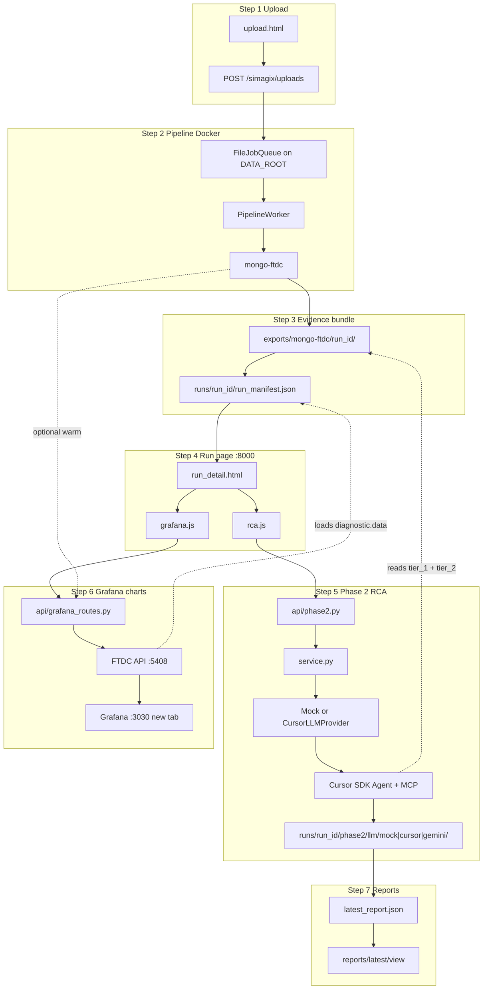
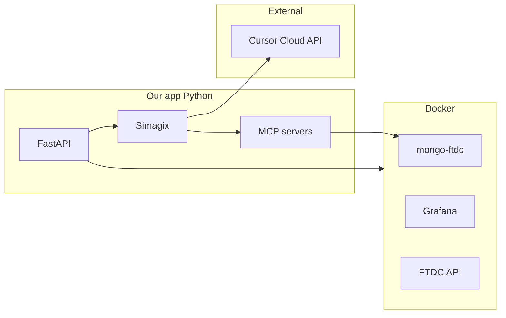
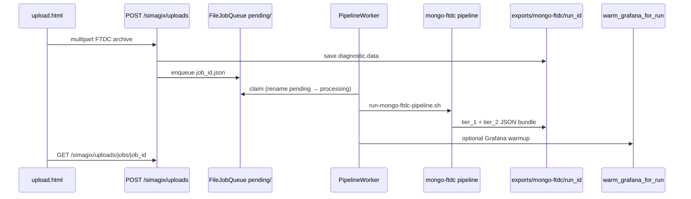
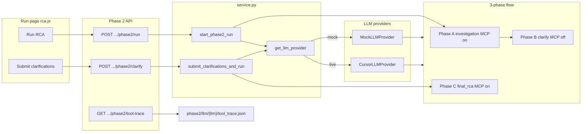
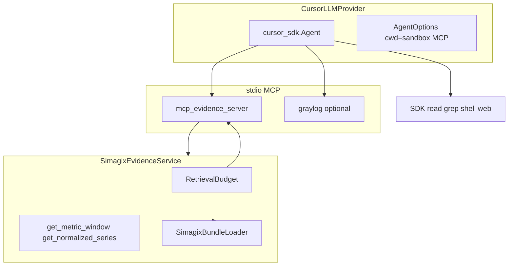
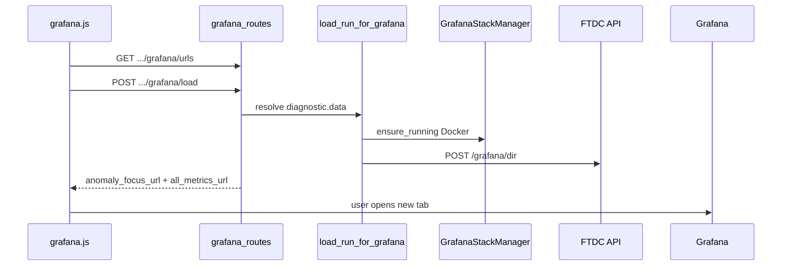
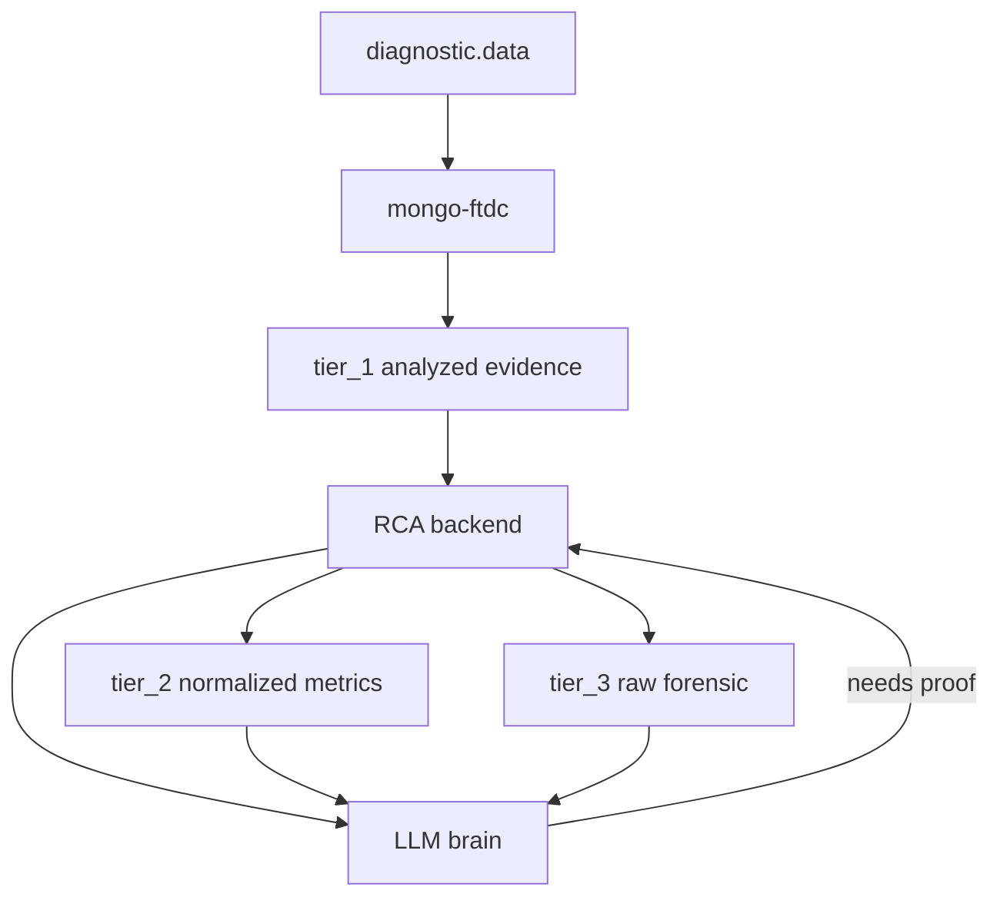

# Architecture

**Last updated:** 2026-06-18

## Purpose

Mongo Debugger turns MongoDB FTDC diagnostic data into actionable root-cause analysis. The design separates **deterministic analysis** from **reasoning**, so the LLM never has to rediscover health issues from raw metrics.

## High-level system map

**Interactive view:** Open [mongo-debugger-architecture.canvas.tsx](/Users/prateek.agarwal/.cursor/projects/Users-prateek-agarwal-Documents-Intern-Projects-Mongo-Debugger/canvases/mongo-debugger-architecture.canvas.tsx) beside the chat for clickable steps 1–7 with detail zoom panels.

Mermaid diagrams below render in GitHub and Cursor markdown preview. Read the **master diagram** first; zoom sections A–D expand individual steps.

### Master diagram (steps 1–7)



| Step | What happens | Zoom detail |
|------|----------------|-------------|
| 1–2 | Upload + Docker pipeline | [Zoom A](#zoom-a-steps-12-upload) |
| 3 | Tiered JSON bundle on disk | [Evidence tiers](#evidence-tiers) below |
| 4 | User lands on run page | [UI → API table](#ui--api-quick-reference) |
| 5 | RCA: investigation → clarify → final | [Zoom B](#zoom-b-step-5-phase-2) + [Zoom C](#zoom-c-step-5-agent--mcp) |
| 6 | Grafana load + open dashboards | [Zoom D](#zoom-d-step-6-grafana) |
| 7 | Persisted report + HTML view | — |

The browser talks only to **FastAPI** (`localhost:8000`). Grafana opens in a **new tab** (`localhost:3030`) after the backend loads FTDC into the shared FTDC API. Step 4 branches: **Phase 2 RCA** (steps 5 → 7) and **Grafana** (step 6).

### Technology stack

| Master step | Component | Provided by | Repo / path |
|-------------|-----------|-------------|-------------|
| — | HTTP server | **uvicorn** + **FastAPI** | `pyproject.toml`, `backend/app/main.py` |
| 4 | HTML pages | **Jinja2** templates | `frontend/templates/` |
| 4 | Run-page JS | **Vanilla JS** | `frontend/static/js/rca.js`, `grafana.js` |
| 1 | File upload | **FastAPI** `UploadFile` | `api/upload.py` |
| 2 | Background job | **Python** `threading` + `subprocess` | `jobs/pipeline.py` |
| 2 | FTDC analysis | **mongo-ftdc** (Go, Docker) | `simagix-workspace/scripts/run-mongo-ftdc-pipeline.sh` |
| 2 | Container runtime | **Docker Compose** | `simagix-workspace/docker/grafana-compose.yaml` |
| 3 | Evidence JSON | **mongo-ftdc** export | `exports/mongo-ftdc/<run_id>/` |
| 3 | Bundle loading | **SimagixBundleLoader** | `backend/app/simagix/bundle.py` |
| 5 | REST Phase 2 | **FastAPI** routers | `api/phase2.py` |
| 5 | Evidence service | **SimagixEvidenceService** | `backend/app/simagix/evidence_service.py` |
| 5 | Report schemas | **Pydantic** | `backend/app/simagix/output_schema.py` |
| 5 | Live LLM agent | **cursor-sdk** | `llm/cursor_provider.py` |
| 5 | Mock LLM | **MockLLMProvider** | `llm/mock_provider.py` |
| 5 | Model inference (live) | **Cursor Cloud API** | `CURSOR_API_KEY` |
| 5 | Evidence MCP | **mcp** (FastMCP) | `llm/mcp_evidence_server.py` |
| 5 | Optional logs MCP | **mcp** Graylog server | `llm/graylog_mcp_server.py` |
| 5 | SDK local tools | **cursor-sdk** built-ins | `tool_trace.json` |
| 5 | Tool budget | **RetrievalBudget** | `simagix/budget.py` |
| 6 | Grafana UI | **Grafana OSS** | `:3030` |
| 6 | FTDC chart API | **mongo-ftdc** FTDC API | `:5408`, `POST /grafana/dir` |
| 7 | Report HTML | Jinja2-assembled string | `report_html.py` |

**Layers:** Our code = FastAPI + Simagix Python + vanilla JS. **Deterministic analysis** = mongo-ftdc in Docker (not the LLM). **Reasoning** = cursor-sdk + Cursor Cloud; evidence via MCP reading the export bundle. **Charts** = Grafana + FTDC API (singleton per machine).

### RunWorkspace — path seam (K8s prep)

**Implemented** in `backend/app/core/run_workspace.py`. All backend modules resolve run-scoped paths via `get_run_workspace()` (or `RunWorkspace(root)` in tests/scripts). Set `DATA_ROOT=/data` when the PVC is mounted at `/data`.

- **Root** from `DATA_ROOT` (repo root locally, `/data` PVC in K8s).
- **Named methods** — `uploads_dir(run_id)`, `exports_dir(run_id)`, `phase2_dir(run_id)`, `list_run_ids()`, etc. — so HTTP handlers never encode folder layout.

Why full `RunWorkspace` instead of only `get_data_root()`: configurable root fixes the mount point; named methods fix duplicated layout strings across 5+ files. Pattern: **Adapter** (domain → paths); later **Strategy** for filesystem vs object storage.

```
  upload API  ──► RunWorkspace.uploads_dir(run_id)  ──► /data/.../uploads/{id}/
  evidence    ──► RunWorkspace.exports_dir(run_id)  ──► /data/.../exports/mongo-ftdc/{id}/
  phase2      ──► RunWorkspace.llm_session_dir(...) ──► /data/.../runs/{id}/phase2/llm/{llm}/
```

Full comparison table and mentor Q&A: [DESIGN_NOTES.md §14.3](DESIGN_NOTES.md#143-runworkspace--why-full-module-not-just-get_data_root).



### UI → API quick reference

| Master step | UI element | JS / page | API endpoint | Backend module |
|-------------|------------|-----------|--------------|----------------|
| 1–2 | Upload FTDC | `upload.html` | `POST /simagix/uploads` | `upload.py` → `FileJobQueue` → `PipelineWorker` |
| 4 | Run list | `runs.html` | `GET /runs` (HTML) | `web/routes.py` |
| 5 | Run RCA | `rca.js` | `POST .../phase2/run`, `.../clarify` | `phase2.py` → `service.py` |
| 5 | Tool trace | `rca.js` | `GET .../phase2/tool-trace` | `tool_trace.py` |
| 6 | Load Grafana | `grafana.js` | `POST .../grafana/load` | `grafana/service.py` |
| 7 | HTML report | `run_detail.html` | `GET .../reports/latest/view` | `report_html.py` |
| — | Tier-1 tools | Swagger `/docs` | `GET .../tools/*` | `simagix_runs.py` |

### Zoom A — Steps 1–2 (upload)

*Continues from master steps 1 → 2 → 3.*



Sources: [`backend/app/api/upload.py`](../backend/app/api/upload.py), [`backend/app/jobs/worker.py`](../backend/app/jobs/worker.py), [`backend/app/jobs/pipeline.py`](../backend/app/jobs/pipeline.py).

### Pipeline worker — durable queue (K8s prep)

**Implemented** as a **standalone process** (not a thread inside the API).

| Piece | Path / command |
|-------|----------------|
| Enqueue | API writes `data/job_queue/pending/{job_id}.json` |
| Claim | Worker atomic rename → `processing/` |
| Status | `data/jobs/{job_id}.json` (+ `runs/{run_id}/job_status.json`) |
| Run | `uv run python -m backend.app.jobs.worker` |
| Shared root | `DATA_ROOT` (repo locally, PVC mount `/data` in K8s) |

**Crash recovery:** on worker startup, every file in `processing/` moves back to `pending/` (assumes previous worker died mid-run; pipeline re-runs for that `run_id`).

**v1 ops:** run **one** worker replica. Multi-worker needs file locking or a broker queue (see DESIGN_NOTES §14.4).

Full comparison: [DESIGN_NOTES.md §14.4](DESIGN_NOTES.md#144-pipeline-worker--file-queue-not-upload-thread).

### Zoom B — Step 5 (Phase 2)

*Continues from master step 5 (`rca.js` → `phase2.py`). Feeds step 7.*



`get_llm_provider`: `force_mock` or `LLM_PROVIDER=mock` → mock; `LLM_PROVIDER=gemini` + `GOOGLE_API_KEY` → Gemini ADK; `LLM_PROVIDER=cursor` + `CURSOR_API_KEY` → Cursor SDK; else mock.

Persistence: `simagix-workspace/runs/<run_id>/phase2/llm/{llm}/` — per-LLM `investigation.json`, `iterative_state.json`, `latest_report.json`, `tool_trace.json`, `budget_state.json`, `session_metadata.json`. FTDC bundle under `exports/mongo-ftdc/<run_id>/` is shared.

### Zoom C — Step 5 (agent + MCP)

*Inside Zoom B when `CursorLLMProvider` is used. Reads step 3 bundle via MCP.*



MCP budget counts evidence tools only; SDK local/web tools appear in **Agent Tool Activity** (`tool_trace.json`).

Sources: [`cursor_provider.py`](../backend/app/simagix/llm/cursor_provider.py), [`mcp_evidence_server.py`](../backend/app/simagix/llm/mcp_evidence_server.py).

### Zoom D — Step 6 (Grafana)

*Continues from step 4 (`grafana.js`) and step 6. Uses `run_manifest.json` from step 3.*



Sources: [`grafana.js`](../frontend/static/js/grafana.js), [`grafana/service.py`](../backend/app/grafana/service.py).

---

## Role split

| Layer | Responsibility | Does reasoning? |
|-------|----------------|---------------|
| **mongo-ftdc** | Decode FTDC, score metrics, run diagnosis rules, produce findings and anomaly timelines | No |
| **RCA backend** | Load analyzed bundles, assemble prompt context, expose fallback retrieval tools | No |
| **LLM (Phase 2)** | Interpret findings, correlate events, hypothesize, explain root cause, write RCA report | Yes |



## Evidence tiers

Defined in [export_contract.md](export_contract.md) (`v1.0.0`). For the optimization rationale and field origins, see [EVIDENCE_GUIDE.md](EVIDENCE_GUIDE.md).

### Tier 1 — Analyzed (primary)

What mongo-ftdc already computed. This is the authoritative analyzed report.

- `llm/executive_context.json` — compact entrypoint
- `diagnosis/findings.json` — named issues with severity and suggestions
- `diagnosis/anomaly_timeline.json` — full anomaly event list
- `diagnosis/activity_summary.json` — workload profile
- `assessment/assessment.json` — per-metric scores
- `assessment/formulas.json` — scoring thresholds

The LLM and RCA backend **always start here**.

### Tier 2 — Normalized (fallback)

Exact metric time series for proof when tier_1 is insufficient.

- `normalized/time_series.jsonl.gz`
- `normalized/replication_lags.json`
- `normalized/disk_stats.json`
- `normalized/server_status.jsonl.gz`

Reachable only through backend fallback tools (`get_metric_window`, `get_normalized_series`).

### Tier 3 — Raw (forensic)

Raw decoder `DataPointsMap` values. Opt-in only (`-tier=forensic` or `-raw=true`).

- `raw/raw_metric_values.jsonl.gz`

## RCA backend

The active backend is **Simagix-only**. It reads pre-analyzed mongo-ftdc export bundles from `simagix-workspace/exports/`.

- Module: `backend/app/simagix/`
- API prefix: `/simagix/runs/{run_id}/`
- Input: tiered JSON bundle produced by `cmd/llm-export`

## Run identity

Every pipeline execution uses a shared `run_id`:

```text
simagix-workspace/
  reports/mongo-ftdc/<run_id>/     # Human HTML + console report
  exports/mongo-ftdc/<run_id>/     # Tiered evidence bundle
  runs/<run_id>/run_manifest.json  # Links report + export
```

This prevents mismatched time windows between human reports and machine-readable exports.

## Phase 2 LLM integration

**Status:** Complete. Cursor SDK agent + in-process MCP evidence server.

Canonical 3-phase flow:

| Phase | Endpoint | MCP | Output |
|-------|----------|-----|--------|
| A — Investigation | `POST .../phase2/run` | On | `phase2/llm/{llm}/investigation.json` |
| B — Clarify | (same request) | Off | Clarifying questions in session state |
| C — Final RCA | `POST .../phase2/clarify?llm=` | On | `RCAReportDraft` → `phase2/llm/{llm}/latest_report.json` |

Session state: `GET .../phase2/status?llm=`. Package builder (`/phase2/package`) remains for tooling and tests.

See [PHASE2_LLM.md](PHASE2_LLM.md).

## Docker prerequisite

These paths require **Docker** (on Mac: **Colima** running):

- `run-mongo-ftdc.sh`, `run-llm-export.sh`, `run-mongo-ftdc-pipeline.sh` — `simagix/ftdc` and `golang:1.25` images
- Web **upload** jobs — same pipeline in a background thread
- **Grafana** — `docker compose` stack (`grafana-compose.yaml`)

The FastAPI backend (`uvicorn`) runs without Docker. Start Colima once per session: `colima start --cpu 4 --memory 8`.

## Grafana charts

One **shared** local stack per machine (Grafana `:3030`, FTDC API `:5408`). Each run reloads its own `diagnostic.data` via `POST /simagix/runs/{run_id}/grafana/load`. Dashboards open in a **new browser tab** (no iframe). Upload pipeline may warm Grafana after export.

## Web upload

`POST /simagix/uploads` accepts `.zip`, `.tar.gz`, or a single `metrics.*` file. Data lands in `simagix-workspace/data/uploads/<run_id>/diagnostic.data/`, then the Docker pipeline produces the export bundle under `exports/mongo-ftdc/<run_id>/`.

## Future enrichers

When available, these tools add more analyzed context (same tier_1-first pattern):

| Tool | Input | Adds |
|------|-------|------|
| Hatchet | `mongod.log` | Slow queries, COLLSCANs, log evidence |
| Keyhole | `MONGO_URI` | Cluster metadata, indexes, schema |
| Maobi | Keyhole output | Human-readable cluster health report |
