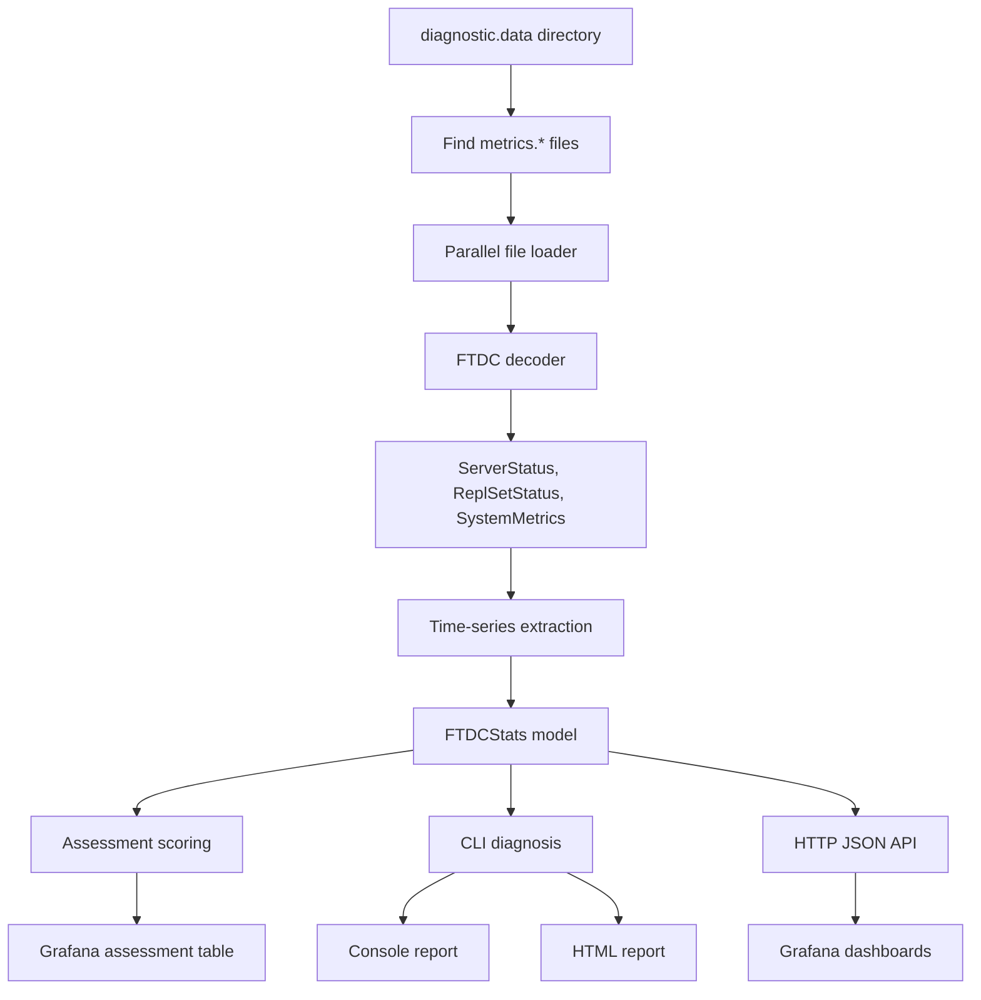
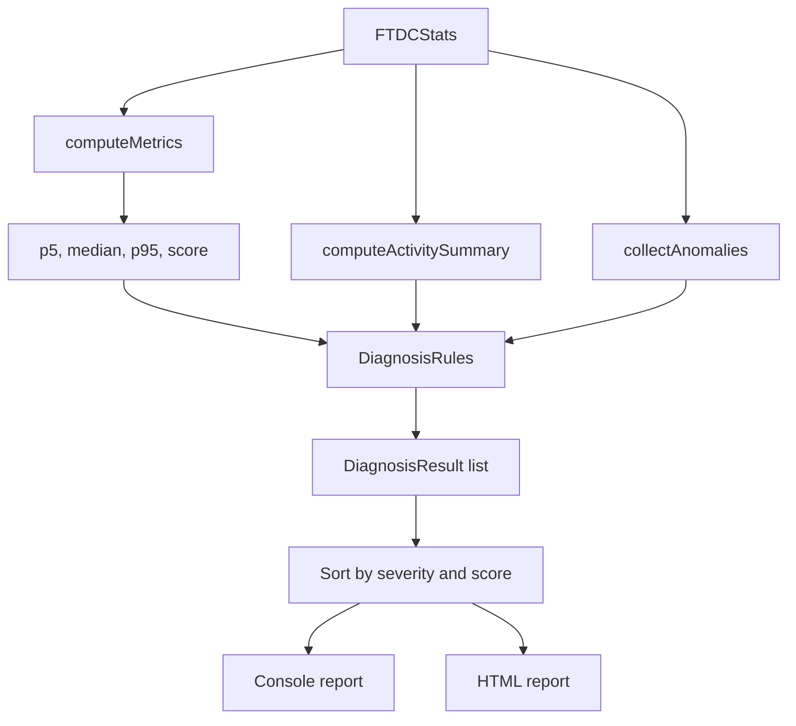
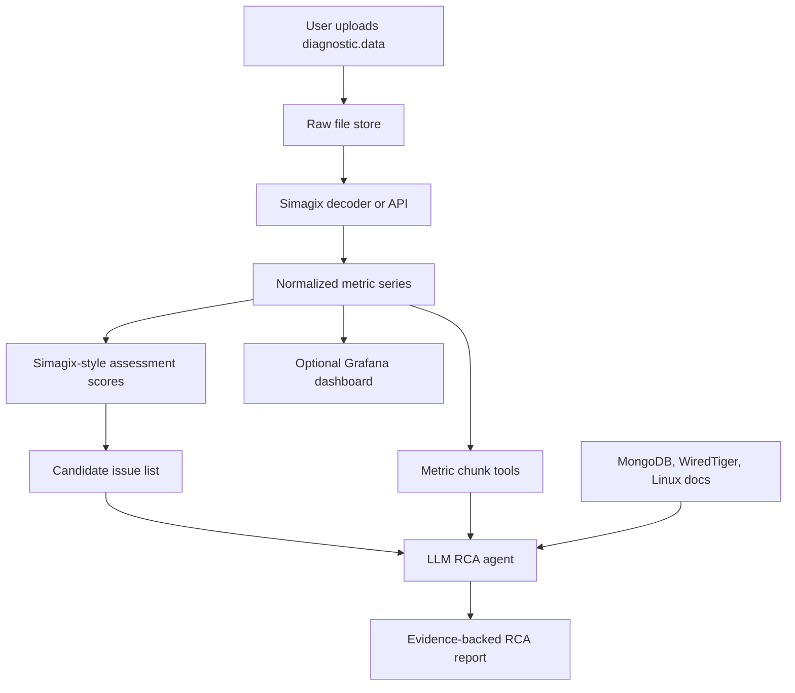
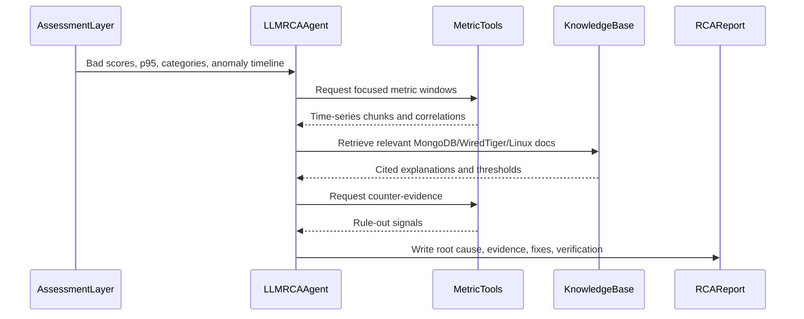

# FTDC Reference

> **Note:** This is a long-form engineering reference (theory, research, integration ideas). For **current** implementation status, quick start, and operations, use [README.md](README.md) and [PROJECT_STATUS.md](PROJECT_STATUS.md). Status tables below may be historical.

## Purpose

Mongo Debugger accepts MongoDB FTDC files from `diagnostic.data`, decodes them into structured time-series metrics, assesses MongoDB health, and generates root-cause analysis reports using deterministic evidence plus LLM reasoning.

This document records the engineering theory, source research, architecture reasoning, and integration ideas around [simagix/mongo-ftdc](https://github.com/simagix/mongo-ftdc), because that project is highly relevant to our decoder, assessment, visualization, and safe-sharing design.

## Implementation workspace

Simagix workspace layout: [SIMAGIX_WORKSPACE.md](SIMAGIX_WORKSPACE.md). Full documentation index: [README.md](README.md).

### Historical implementation status (Phase 1 snapshot)

| Component | Status | Location |
|-----------|--------|----------|
| Docker FTDC pipeline | Complete | `simagix-workspace/scripts/` |
| Unified `run_id` (report + export) | Complete | `simagix-workspace/runs/<run_id>/` |
| Tiered evidence export (`v1.0.0`) | Complete | `simagix-workspace/exports/mongo-ftdc/<run_id>/` |
| RCA backend (orchestration only) | Complete | `backend/app/simagix/` |
| Phase 2 LLM scaffolding | Scaffolded | prompt, grounding, budget, output schema |
| Hatchet / Keyhole / Maobi | Scripted | Blocked on input artifacts |

Validated test run: `phase1test20260609T133314Z` (25 files, 4 findings, 164 anomalies). Backend tests: 12/12 pass.

### Architecture (implemented)

```text
mongo-ftdc  ->  deterministic analysis (findings, scores, anomalies)
RCA backend ->  load tier_1, assemble context, expose fallback tools (NO reasoning)
LLM         ->  interpret, correlate, hypothesize, explain, write RCA (Phase 2 brain)
```

### Tiered evidence contract

Defined in [export_contract.md](export_contract.md).

```text
tier_1_analyzed   -> primary input (executive_context, findings, anomaly_timeline, assessment)
tier_2_normalized -> fallback tool retrieval only (time_series, repl_lags, disk_stats)
tier_3_raw        -> forensic fallback only (opt-in via -tier=forensic or -raw=true)
```

The exporter at `simagix-workspace/repos/mongo-ftdc/cmd/llm-export` writes:

- `llm/executive_context.json` — compact analyzed entrypoint (top anomaly windows, assessment highlights)
- `llm/fallback_retrieval_index.json` — metric → file → time window for tool calls
- `diagnosis/findings.json`, `diagnosis/anomaly_timeline.json`, `diagnosis/activity_summary.json`
- `assessment/assessment.json`, `assessment/formulas.json`
- `normalized/` — tier_2 time series (default export tier)
- `raw/` — tier_3 forensic data (off by default)
- `bundle_index.json`, `validation.json`, atomic `manifest.json`

### RCA backend API

```bash
# Mac: Docker (Colima) required for upload pipeline + Grafana, not for uvicorn alone
colima start --cpu 4 --memory 8

uv run uvicorn backend.app.main:app --reload --port 8000
curl http://localhost:8000/simagix/runs/<run-id>/context
curl -X POST http://localhost:8000/simagix/runs/<run-id>/phase2/run -H 'Content-Type: application/json' -d '{"force_mock": true}'
```

Full API reference: [`docs/RCA_BACKEND.md`](docs/RCA_BACKEND.md).

### Recommended evidence flow

```text
1. RCA backend loads tier_1 analyzed evidence (mongo-ftdc findings)
2. LLM reads executive_context + findings + top anomaly windows
3. If proof needed, LLM calls fallback tools (metric-window, normalized-series)
4. LLM writes RCAReportDraft with citations — never rediscovers from raw FTDC
```

## Executive Summary

[simagix/mongo-ftdc](https://github.com/simagix/mongo-ftdc) is not just a Grafana dashboard. It contains:

- an FTDC decoder;
- a parallel file loader;
- a normalized time-series extraction layer;
- an assessment scoring engine;
- a CLI diagnosis engine;
- an HTTP API for Grafana;
- preconfigured Grafana dashboards;
- an obfuscation utility for safe sharing.

It is therefore directly relevant to Mongo Debugger.

The best role for Simagix in our architecture is:

```text
mongo-ftdc (Simagix):
  decode FTDC, score metrics, run diagnosis rules, produce findings

Mongo Debugger RCA backend:
  load tier_1 analyzed evidence, assemble LLM context, expose fallback tools
  (orchestration only — no reasoning)

LLM RCA analyst (Phase 2):
  interpret findings, correlate events, hypothesize, explain root cause, write RCA
```

The key distinction:

- Simagix identifies **what looks unhealthy** (deterministic).
- The LLM identifies **why it happened and what to do safely** (reasoning).
- The RCA backend is a **pipe**, not a brain.

## Main Sources Reviewed

- [simagix/mongo-ftdc README](https://github.com/simagix/mongo-ftdc)
- [Simagix FTDC overhaul article](https://www.simagix.com/2025/12/mongodb-ftdc-open-source-overhaul.html)
- [DeepWiki Metrics Assessment](https://deepwiki.com/simagix/mongo-ftdc/3.3-metrics-assessment)
- [MongoDB FTDC documentation](https://www.mongodb.com/docs/v8.2/administration/full-time-diagnostic-data-capture/)
- [MongoDB serverStatus documentation](https://www.mongodb.com/docs/manual/reference/command/serverstatus/)
- [MongoDB WiredTiger storage engine documentation](https://www.mongodb.com/docs/manual/core/wiredtiger/)
- [WiredTiger eviction architecture](http://source.wiredtiger.com/mongodb-4.4/arch-eviction.html)
- [WiredTiger checkpoint architecture](https://source.wiredtiger.com/11.2.0/arch-checkpoint.html)

## What Simagix mongo-ftdc Is

The README describes it as:

> A tool to analyze MongoDB FTDC data with automatic diagnostics and Grafana dashboards.

It supports two primary workflows:

1. Quick CLI analysis:

```bash
./build.sh
./dist/mftdc diagnostic.data/
```

This generates:

- console report with detected issues;
- HTML report saved under `html/ftdc_diagnosis.html` or per-file HTML name.

2. Interactive Grafana mode:

```bash
./build.sh docker
docker-compose up
```

This starts:

- `simagix/ftdc`: parser and API server;
- `simagix/grafana-ftdc`: Grafana with dashboards.

Default ports:

| Service | Port | Use |
| --- | ---: | --- |
| Grafana | 3030 | Dashboard UI |
| FTDC API | 5408 | JSON data backend |

## High-Level Simagix Flow



## Important Repository Files

| File | Role |
| --- | --- |
| `README.md` | Usage, CLI, Docker, Grafana, obfuscation, features. |
| `main/mftdc.go` | CLI entrypoint. Runs diagnosis by default, server mode with `-server`, obfuscation mode with `-obfuscate`. |
| `diagnostic.go` | Reads FTDC files, decodes them, parallelizes file loading, builds diagnostic documents. |
| `decoder/metrics.go` | Parses FTDC binary chunks, decompresses zlib blocks, decodes chunks in parallel. |
| `attribs.go` | Maps decoded FTDC paths to typed `ServerStatusDoc` and `SystemMetricsDoc`. |
| `server_status.go` | Defines MongoDB serverStatus structures used by extraction. |
| `system_metrics.go` | Defines CPU and disk system metric structures. |
| `replset_status.go` | Defines replica set status structures. |
| `optime.go` | Extracts optime timestamp from multiple BSON shapes. |
| `time_series_data.go` | Converts raw server/repl/system documents into normalized chart metrics. |
| `metrics.go` | Holds `FTDCStats`, HTTP API handlers, Grafana query/search/dir endpoints. |
| `assessment.go` | Scores metrics with p5, median, p95, low/high thresholds. |
| `diagnosis.go` | Converts assessment/anomaly signals into named problem reports and suggestions. |
| `obfuscate.go` | Obfuscates hostnames, IPs, replica set names, and paths while preserving metrics. |

## Decoder And Loading Architecture

### File Discovery

Simagix accepts either:

- a `diagnostic.data` directory;
- individual `metrics.*` files;
- `keyhole_stats.*` files.

It filters files with:

```text
metrics.*
keyhole_stats.*
```

### Parallel FTDC File Loading

In `diagnostic.go`, `readDiagnosticFiles()`:

- sorts files by filename;
- uses `runtime.NumCPU() - 1` worker capacity;
- reads files concurrently;
- stores per-file results;
- sorts results after decoding;
- pre-allocates final slices for serverStatus, systemMetrics, and replSetStatus;
- merges results in filename order.

This is one major reason Simagix should be faster than our current `pyftdc` proof.

Our current implementation decodes sequentially. Simagix already uses parallel file loading.

### FTDC Chunk Decoding

In `decoder/metrics.go`, `ReadAllMetrics()`:

1. Scans the BSON container.
2. Finds type `0` metadata documents and type `1` metric chunks.
3. Extracts compressed binary chunks.
4. Skips the first four bytes of the binary block.
5. Decompresses zlib data.
6. Decodes metric blocks.
7. Processes compressed blocks in parallel using `runtime.NumCPU()`.

This aligns with MongoDB FTDC format docs: FTDC metric chunks are BSON containers around compressed binary metric chunks, and the metric data is zlib compressed with internal numeric delta encoding.

## Data Extraction Layer

Simagix does not keep raw paths only. It maps decoded FTDC paths into structured documents.

### ServerStatus Extraction

`attribs.go` maps paths like:

```text
serverStatus/connections/current
serverStatus/opcounters/query
serverStatus/wiredTiger/cache/bytes currently in the cache
serverStatus/queues/execution/read/out
serverStatus/transactions/currentActive
serverStatus/flowControl/timeAcquiringMicros
```

into `ServerStatusDoc`.

Important covered categories:

- memory;
- network;
- connections;
- global lock active and queued clients;
- query executor scans;
- document returned/inserted/updated/deleted;
- operation latencies;
- opcounters;
- WiredTiger block manager;
- WiredTiger cache;
- WiredTiger tickets;
- MongoDB 7+ admission control queues;
- transactions;
- tcmalloc;
- flow control.

### SystemMetrics Extraction

`system_metrics.go` defines:

- CPU idle/user/system/iowait/nice/softirq/steal time;
- disk read time;
- disk write time;
- disk queued time;
- disk I/O time;
- disk reads;
- disk writes;
- I/O in progress.

`attribs.go` extracts disk fields from dynamic paths under:

```text
systemMetrics/disks/<device>/<stat>
```

This matters for us because disk devices are dynamic and cannot be hardcoded.

### Replica Set Extraction

`replset_status.go` and `optime.go` extract:

- replica set member names;
- member states;
- optime timestamps.

`time_series_data.go` computes replication lag by:

1. finding the primary member optime;
2. comparing secondary member optime against primary;
3. generating per-host lag time series.

This is a useful model for our replication lag RCA layer.

## Normalized Time-Series Model

The core normalized type is:

```go
type TimeSeriesDoc struct {
    Target string
    DataPoints [][]float64
}
```

Each data point is:

```text
[value, timestamp_ms]
```

This model is Grafana-friendly and also LLM-tool-friendly.

For our app, we can represent the same concept as:

```text
metric_path / metric_alias
timestamp
value
category
unit
source
```

## Time-Series Metrics Simagix Produces

### Server Status Metrics

From `time_series_data.go`, `serverStatusChartsLegends` includes:

- `mem_resident`
- `mem_virtual`
- `mem_page_faults`
- `conns_active`
- `conns_available`
- `conns_current`
- `conns_created/s`
- `latency_read`
- `latency_write`
- `latency_command`
- `net_in`
- `net_out`
- `net_requests`
- `net_physical_in`
- `net_physical_out`
- `ops_query`
- `ops_insert`
- `ops_update`
- `ops_delete`
- `ops_getmore`
- `ops_command`
- `q_active_read`
- `q_active_write`
- `q_queued_read`
- `q_queued_write`
- `scan_keys`
- `scan_objects`
- `scan_sort`
- `query_targeting_keys`
- `query_targeting_objects`
- `doc_returned/s`
- `doc_inserted/s`
- `doc_updated/s`
- `doc_deleted/s`
- `write_conflicts/s`

### WiredTiger Metrics

`wiredTigerChartsLegends` includes:

- `wt_blkmgr_read`
- `wt_blkmgr_written`
- `wt_blkmgr_written_checkpoint`
- `wt_cache_max`
- `wt_cache_used`
- `wt_cache_dirty`
- `wt_modified_evicted`
- `wt_unmodified_evicted`
- `wt_cache_read_in`
- `wt_cache_written_from`
- `wt_dhandles_active`
- `ticket_avail_read`
- `ticket_avail_write`

### MongoDB 7+ Queue / Admission Control Metrics

`queuesChartsLegends` includes:

- `queues_read_out`
- `queues_read_available`
- `queues_read_total`
- `queues_write_out`
- `queues_write_available`
- `queues_write_total`

This is important because MongoDB 7+ moved ticket/admission-control interpretation toward `queues.execution`.

### Transaction Metrics

`transactionsChartsLegends` includes:

- `txn_active`
- `txn_inactive`
- `txn_open`
- `txn_aborted/s`
- `txn_committed/s`
- `txn_started/s`

### Flow Control Metrics

`flowControlChartsLegends` includes:

- `flowctl_rate_limit`
- `flowctl_acquiring_us`
- `flowctl_lagged_count`

### System Metrics

`systemMetricsChartsLegends` includes:

- `cpu_idle`
- `cpu_iowait`
- `cpu_nice`
- `cpu_softirq`
- `cpu_steal`
- `cpu_system`
- `cpu_user`
- `disks_utils`
- `disks_iops`
- `io_in_progress`
- `read_time_ms`
- `write_time_ms`
- `io_queued_ms`

### Replication Metrics

`replSetChartsLegends` includes:

- `replication_lags`

Internally, replication lag is stored per host.

## Metric Derivation Logic

Simagix performs important transformations that our app should learn from.

### Counter To Rate

For counters, it calculates deltas between consecutive samples and divides by elapsed seconds.

Examples:

- `opcounters.query` becomes `ops_query`.
- `connections.totalCreated` becomes `conns_created/s`.
- network byte counters become MB/s.
- document counters become docs/s.
- write conflict counters become `write_conflicts/s`.
- transaction counters become transaction rates.

This is correct. Most FTDC counters should not be interpreted as raw values.

### Latency

It calculates latency as:

```text
latency_total / ops / 1000
```

for:

- reads;
- writes;
- commands.

### CPU Percent

It calculates CPU percentages from deltas of CPU time buckets:

```text
cpu_component_delta / total_cpu_delta * 100
```

This is better than reading raw CPU millisecond counters directly.

### Disk Utilization

It calculates disk utilization as:

```text
100 * delta(io_time_ms) / 1000
```

It also calculates IOPS as:

```text
delta(reads + writes) / seconds
```

It stores:

- utilization;
- IOPS;
- I/O in progress;
- read time delta;
- write time delta;
- queued I/O time delta.

### Query Targeting

It calculates:

```text
query_targeting_keys = keys_examined_delta / docs_returned_delta
query_targeting_objects = docs_examined_delta / docs_returned_delta
```

This is very useful for missing-index detection.

## Assessment Engine

The `assessment.go` file defines an assessment scoring system.

### Score Meaning

Scores range from `0` to `100`.

- `100`: good.
- `0`: bad.
- `1-99`: proportional between low and high watermarks.
- `101`: not assessed or unavailable (**N/A sentinel — not healthy**).

The scoring formula is implemented by `GetScoreByRange()` in `utils.go`:

```text
value < low threshold  -> 100
value > high threshold -> 0
between thresholds     -> linear score
NaN                    -> 101
no FormulaMap entry    -> 101 (e.g. conns_active has stats but no score formula)
missing metric/data    -> 101
```

Important: lower score means more concerning. **Never interpret 101 as healthy.** Metrics like `conns_active` may show real p5/median/p95 values with score 101 because they are tracked but not health-scored. The assessment table and `assessment_highlights` exclude score 101 unless verbose mode is enabled.

The RCA backend injects `score_semantics` into LLM context so the model understands this convention.

### Assessment Statistics

For each metric, Simagix computes:

- p5;
- median;
- p95;
- score.

This is better than using only average or max. It is more robust and similar to what a human performance engineer would check.

### Assessment Time Range

The current code allows assessment for time ranges up to `72` hours. Older documentation said less than 24 hours, but the current source uses:

```go
if to.Sub(from) <= 72*time.Hour
```

## Assessment Metrics And Thresholds

### Connections

| Metric | Formula | Low | High |
| --- | --- | ---: | ---: |
| `conns_created/s` | new connections per second | 0 | 5 |
| `conns_current` | `1MB * p95(conns_current) / RAM` | 5 | 20 |

Meaning:

- high `conns_current` means memory pressure from open connections;
- high `conns_created/s` means connection churn or bad pooling.

### CPU

| Metric | Formula | Low | High |
| --- | --- | ---: | ---: |
| `cpu_idle` | p5 idle | 50 | 80 |
| `cpu_iowait` | p95 iowait | 5 | 15 |
| `cpu_system` | p95 system | 5 | 15 |
| `cpu_user` | p95 user | 50 | 70 |

Meaning:

- low idle indicates CPU saturation;
- high iowait indicates storage waits;
- high system may indicate kernel overhead;
- high user may indicate query/compute pressure.

### Disk

| Metric | Formula | Low | High |
| --- | --- | ---: | ---: |
| `disku_<dev>` | p95 disk utilization | 50 | 90 |
| `iops_<dev>` | p95 IOPS / average IOPS | 2 | 4 |

Meaning:

- high disk utilization indicates storage pressure;
- high IOPS variance indicates bursty I/O.

### Latency

| Metric | Formula | Low | High |
| --- | --- | ---: | ---: |
| `latency_read` | p95 read latency ms | 20 | 100 |
| `latency_write` | p95 write latency ms | 20 | 100 |
| `latency_command` | p95 command latency ms | 20 | 100 |

### Memory

| Metric | Formula | Low | High |
| --- | --- | ---: | ---: |
| `mem_resident` | resident memory / RAM | 70 | 90 |
| `mem_page_faults` | p95 page faults | 10 | 20 |
| `tcmalloc_fragmentation` | heap fragmentation ratio | 20 | 50 |

### Operations And Queues

| Metric | Formula | Low | High |
| --- | --- | ---: | ---: |
| `ops_<op>` | operation rate | 0 | 64000 |
| `queued_read` | p95 read queue | cores | 5 * cores |
| `queued_write` | p95 write queue | cores | 5 * cores |

Queue thresholds are adjusted based on host CPU cores.

### Query Scans

| Metric | Formula | Low | High |
| --- | --- | ---: | ---: |
| `scan_keys` | key scan rate | 0 | 1,048,576 |
| `scan_objects` | average objects / keys | 2 | 5 |
| `scan_sort` | in-memory sort rate | 0 | 1000 |
| `query_targeting_keys` | p95 keys examined / docs returned | 10 | 100 |
| `query_targeting_objects` | p95 docs examined / docs returned | 10 | 100 |

### WiredTiger

| Metric | Formula | Low | High |
| --- | --- | ---: | ---: |
| `wt_cache_used` | p95 cache used / max cache | 80 | 95 |
| `wt_cache_dirty` | p95 dirty cache / max cache | 5 | 20 |
| `wt_dhandles_active` | p95 active data handles | 16000 | 20000 |
| `wt_modified_evicted` | modified evictions / 5 percent cache pages | 5 | 10 |
| `wt_unmodified_evicted` | unmodified evictions / 5 percent cache pages | 5 | 10 |

### Replication

| Metric | Formula | Low | High |
| --- | --- | ---: | ---: |
| `repl_lag_<host>` | p95 replication lag seconds | 5 | 30 |

### MongoDB 7+ Admission Control

| Metric | Formula | Low | High |
| --- | --- | ---: | ---: |
| `queues_read_out` | p95 read out / total tickets | 50 | 90 |
| `queues_write_out` | p95 write out / total tickets | 50 | 90 |

### Transactions

| Metric | Formula | Low | High |
| --- | --- | ---: | ---: |
| `txn_inactive` | p95 inactive transactions | 5 | 20 |
| `txn_aborted/s` | p95 aborted transactions per second | 10 | 50 |

### Flow Control

| Metric | Formula | Low | High |
| --- | --- | ---: | ---: |
| `flowctl_lagged_count` | p95 lagged count | 1 | 3 |
| `flowctl_acquiring_us` | p95 acquiring time in ms | 100 | 1000 |

## Diagnosis Engine

The `diagnosis.go` file builds on assessment. It does not just produce metric scores; it groups signals into named issues.

### Diagnosis Workflow



### Activity Summary

The diagnosis report always includes activity summary metrics:

- operations per second;
- p95 read/write/command latency;
- key/object scans;
- docs returned;
- CPU user/system/idle;
- RAM resident percentage;
- WiredTiger cache usage percentage;
- max disk utilization;
- network throughput;
- active/current connections.

This is useful for LLM context because it gives a compact workload profile.

### Anomaly Timeline

Simagix collects anomaly events for:

- read/write/command latency greater than 20 ms;
- scan keys/objects greater than 100K per second;
- CPU idle below 30 percent;
- CPU iowait greater than 15 percent;
- page faults greater than 20 per second;
- queued reads/writes greater than 10;
- write conflicts greater than 10 per second;
- disk utilization greater than 70 percent;
- replication lag greater than 5 seconds.

Only events lasting at least 10 seconds are included.

This is very relevant to our app because it creates incident windows that the LLM can investigate.

## Diagnosis Rules Provided

The current `DiagnosisRules` include these issue types.

### 1. Connection Pool Misconfiguration

Triggers when:

- `conns_current` score is poor;
- or connections and memory are both concerning.

Symptoms include:

- high connection p95;
- connection spikes above 50 percent of median;
- high `conns_created/s`;
- memory pressure;
- elevated read latency.

Suggestion:

- reduce `maxPoolSize`;
- use pooling middleware;
- remember each connection uses roughly 1 MB RAM.

Usefulness for Mongo Debugger:

- high.
- This maps well to connection spike RCA.

### 2. Replication Lag Issues

Triggers when:

- any host replication lag score is below threshold.

Symptoms include:

- p95 replication lag per host;
- time ranges where lag exceeded 5 seconds;
- high insert/update rates as related evidence.

Suggestion:

- check network latency;
- upgrade secondary hardware;
- review oplog size;
- scale cluster if needed.

Usefulness:

- high as assessment;
- RCA still needs deeper checks such as secondary disk, apply throughput, flow control, and optime spread.

### 3. Working Set Exceeds RAM

Triggers when:

- `wt_cache_used` score is very poor;
- or modified and unmodified eviction scores are both poor;
- or page faults score is poor.

Symptoms include:

- WiredTiger cache saturated;
- dirty page evictions;
- clean page evictions;
- page faults;
- disk utilization correlation.

Suggestion:

- add RAM or scale up;
- create indexes;
- archive old data;
- consider sharding.

Usefulness:

- high for broad working-set/cache pressure detection.
- It is not enough for nuanced history-store/update-cache RCA.

### 4. Write Contention

Triggers when:

- `write_conflicts/s` score is poor;
- or `txn_aborted/s` score is poor.

Symptoms include:

- write conflicts;
- transaction aborts;
- inactive transactions;
- write queue depth.

Suggestion:

- review hot document patterns;
- use optimistic concurrency;
- redesign schema to distribute writes;
- reduce transaction scope.

Usefulness:

- medium-high.
- Good for hot-document and transaction contention hints.

### 5. Missing Indexes

Triggers when:

- `query_targeting_keys` is poor;
- or `query_targeting_objects` is poor;
- or `scan_keys` is poor.

Symptoms include:

- keys examined per doc returned;
- docs examined per doc returned;
- keys scanned per second;
- objects scanned per key.

Suggestion:

- run `explain()`;
- create compound indexes;
- use covered queries;
- use `$hint` where appropriate.

Usefulness:

- high.
- This is directly useful for slow query RCA.

### 6. Memory Fragmentation

Triggers when:

- tcmalloc fragmentation score is poor.

Symptoms:

- p95 fragmentation percentage.

Suggestion:

- consider restart during maintenance;
- monitor memory growth.

Usefulness:

- medium.
- Should be treated carefully because restart advice is operationally sensitive.

### 7. CPU Saturation

Triggers when:

- CPU idle score is poor;
- CPU user score is poor;
- CPU system score is poor.

Symptoms include:

- low CPU idle;
- high CPU user;
- high CPU system;
- high CPU iowait.

Suggestion:

- profile slow queries;
- add indexes;
- upgrade CPU;
- scale horizontally;
- check `currentOp()`.

Usefulness:

- high as signal;
- RCA needs correlation with query, scan, and workload metrics.

### 8. Disk I/O Bottleneck

Triggers when:

- any disk utilization score is very poor.

Symptoms include:

- p95 disk utilization;
- IOPS spikes;
- CPU iowait.

Suggestion:

- upgrade storage;
- increase IOPS;
- reduce working set;
- optimize readahead.

Usefulness:

- high as signal;
- our RCA must be more careful before recommending faster disk, because writeback and queueing can mimic disk bottlenecks.

### 9. Flow Control Activated

Triggers when:

- flow-control lagged count is positive;
- or flow-control acquire time score is poor.

Symptoms include:

- lagged members;
- flow-control wait time.

Suggestion:

- address replication lag;
- check network;
- upgrade secondary hardware.

Usefulness:

- high for MongoDB 7+ and write throttling investigations.

### 10. Admission Control Queuing

Triggers when:

- `queues_read_out` score is poor;
- or `queues_write_out` score is poor.

Symptoms include:

- read tickets in use;
- write tickets in use.

Suggestion:

- scale up resources;
- optimize queries;
- review concurrent operation patterns.

Usefulness:

- high for MongoDB 7+ ticket/admission-control analysis.
- We should combine this with queue length and latency, not only tickets in use.

## Console And HTML Reports

The CLI diagnosis output includes:

- analysis period;
- duration;
- host;
- MongoDB version;
- activity summary;
- anomaly timeline;
- detected issues;
- symptoms;
- suggestions.

The HTML report contains similar content in a styled page.

This is close to what our first version can use as machine-readable context, but the final RCA still needs deeper narrative and citations.

## HTTP API And Grafana Integration

Simagix exposes HTTP endpoints:

```text
/grafana
/grafana/query
/grafana/search
/grafana/dir
/scores
/scores/<metric>
```

### `/grafana/search`

Returns available metric targets for Grafana.

### `/grafana/query`

Handles Grafana JSON datasource queries.

It supports:

- time-series queries;
- host info table;
- assessment table.

Special query targets include:

- `replication_lags`
- `disks_utils`
- `disks_iops`
- `disks_queue_length`
- `read_time_ms`
- `write_time_ms`
- `io_queued_ms`
- `assessment`
- `host_info`

### `/grafana/dir`

Allows hot reload of a new FTDC directory:

```bash
curl -XPOST http://localhost:5408/grafana/dir -d '{"dir": "/diagnostic.data"}'
```

### `/scores/<metric>`

Returns score formula HTML generated from `FormulaMap`.

This is useful because users can inspect why a score is bad.

## Is Grafana Useful For Our Use Case?

Yes, but not as the primary user experience.

### Where Grafana Is Useful

Grafana is useful for:

- fast visual inspection;
- validating decoder output;
- comparing many metrics over time;
- engineering/debug mode;
- showing screenshots to mentors or support;
- verifying RCA claims visually.

### Where Grafana Is Not Enough

Grafana is not enough for:

- automatic root-cause narrative;
- ruled-out hypotheses;
- safe remediation ranking;
- LLM-guided evidence gathering;
- uploaded-file web app UX;
- non-technical users.

### Recommended Use In Mongo Debugger

Use Grafana as an optional advanced view:

```text
User uploads FTDC
  -> app runs decoder and assessment
  -> app generates RCA report
  -> optional button: Open Grafana-style charts
```

We should not make Grafana mandatory for the main app.

## Obfuscation Utility

Simagix includes an FTDC obfuscator.

It obfuscates:

- hostnames;
- IP addresses;
- replica set names;
- paths containing cluster identifiers;
- TLS/config/key paths where relevant.

It preserves:

- metrics;
- timestamps;
- MongoDB version;
- OS type;
- CPU specs;
- memory specs;
- port numbers.

It uses deterministic mapping, so the same input maps to the same obfuscated output.

This is important for our future app because diagnostic files can expose infrastructure details. We should either integrate Simagix obfuscation or implement a similar safe-sharing step.

## What Simagix Provides That We Should Reuse

### 1. Decoder Performance Ideas

Useful design ideas:

- parallel file loading;
- parallel decompression of chunks;
- pre-allocation of slices;
- one-pass serverStatus conversion;
- dynamic disk key extraction;
- built-in support for MongoDB 7+ queues and flow control.

This directly addresses our current problem: `pyftdc` full decode took about 39 minutes on the sample data.

### 2. Metric Alias Layer

Simagix converts verbose FTDC paths into short metric names:

```text
serverStatus/connections/current -> conns_current
systemMetrics/cpu/iowait_ms -> cpu_iowait
serverStatus/wiredTiger/cache/bytes currently in the cache -> wt_cache_used
```

This is useful because LLM prompts and dashboards should not be filled with raw long FTDC paths.

### 3. Assessment Scoring

The p5/median/p95 plus score model is immediately useful.

Our app should store:

```text
metric
category
p5
median
p95
score
low_watermark
high_watermark
formula
time_range
```

### 4. Diagnosis Rules

The diagnosis rules can seed our playbooks:

- connection pool misconfiguration;
- replication lag;
- working set exceeds RAM;
- write contention;
- missing indexes;
- memory fragmentation;
- CPU saturation;
- disk I/O bottleneck;
- flow control activated;
- admission control queuing.

### 5. Anomaly Timeline

The anomaly timeline is important for RCA because root cause depends on **when** signals overlap.

Our app should extend this with:

- event alignment;
- correlation windows;
- cause/effect ordering;
- ruled-out evidence.

## What Simagix Does Not Fully Provide

Simagix provides assessment and diagnosis, but not the full RCA style we want.

It does not appear to produce:

- deep causal chains like the attached PDF;
- explicit hypothesis trees;
- formal ruled-out causes;
- citation-backed explanations;
- OS-level writeback RCA;
- checkpoint/history-store phase analysis;
- LLM question/answer loop over metric chunks;
- final consultant-style RCA narrative.

Therefore, Simagix should not replace our RCA layer. It should power the evidence and assessment layer.

## Recommended Mongo Debugger Architecture With Simagix



## Recommended Investigation Loop For LLM



## How This Compares To Our Current Backend

Current Mongo Debugger prototype:

- uses `pyftdc`;
- stores selected metrics in DuckDB;
- has basic anomaly detection;
- has early deterministic RCA rules;
- has LLM metric chunk tool concept.

Simagix:

- faster and more mature FTDC loader;
- richer metric extraction;
- better score model;
- diagnosis rules;
- Grafana dashboards;
- obfuscation;
- CLI and server modes.

Gap in our backend:

- decoding too slow;
- metric catalog too narrow;
- RCA rules too shallow;
- no Simagix-style p5/median/p95 score model yet;
- no professional assessment table;
- no obfuscation;
- no full RCA agent loop.

## Recommended Next Steps

### Step 1: Benchmark Simagix On Our Sample

Run:

```bash
git clone https://github.com/simagix/mongo-ftdc
cd mongo-ftdc
./build.sh
./dist/mftdc /path/to/tmp/diagnostic.data
```

Measure:

- total runtime;
- console diagnosis output;
- generated HTML report;
- whether it handles our MongoDB 8.0 FTDC sample;
- whether it detects meaningful issues;
- how its findings compare with our `pyftdc` output.

### Step 2: Decide Integration Mode

Options:

1. Use Simagix as an external CLI.
2. Use Simagix as a local HTTP service.
3. Port the assessment formulas into Python.
4. Use Simagix only as benchmark/reference.

Best first choice:

```text
Use Simagix CLI/API as external assessment backend, keep our RCA engine separate.
```

### Step 3: Store Simagix Assessment Output

Create an internal model:

```text
AssessmentFinding:
  metric
  category
  score
  p5
  median
  p95
  formula
  low_watermark
  high_watermark
  time_range
```

### Step 4: Convert Diagnosis Rules Into RCA Playbooks

Each diagnosis rule becomes a playbook:

```text
Candidate issue:
  Missing Indexes

Required evidence:
  query_targeting_keys
  query_targeting_objects
  scan_keys
  scan_objects
  latency_read

LLM should ask:
  Did latency rise during scan spikes?
  Did CPU rise?
  Did disk reads rise?
  Are writes unaffected?

Possible final cause:
  inefficient query/indexing pattern
```

### Step 5: Keep Final RCA LLM-Driven

The LLM should not blindly trust the diagnosis output. It should:

- inspect bad scores;
- ask for metric chunks;
- fetch relevant docs;
- test competing hypotheses;
- rule out alternatives;
- produce final RCA.

## What You Should Understand As Project Owner

### Assessment Is Not RCA

Assessment says:

```text
disk utilization is bad
cpu_iowait is bad
read latency is bad
```

RCA says:

```text
read latency is bad because cache-miss reads were queued behind kernel writeback bursts, not because the SSD itself was slow.
```

Simagix mostly gives the first. Mongo Debugger must produce the second.

### Decoder Backend Should Be Swappable

Do not tie the product to `pyftdc` or Simagix forever.

The product should depend on this contract:

```text
decoded metric series + assessment scores + metadata
```

Any decoder that can produce that contract can be used.

### LLM Should Use Tools, Not Raw FTDC

The LLM should never parse raw binary FTDC. It should use tools:

- `list_metrics`;
- `get_series`;
- `summarize_window`;
- `get_assessment`;
- `get_anomaly_timeline`;
- `correlate`;
- `retrieve_docs`.

### Articles And Docs Matter

Claude's PDF quality came from:

- decoded metrics;
- domain docs;
- tested hypotheses;
- ruled-out causes;
- clear causal chain.

Our app should replicate that process:

```text
assessment finds where to look
metric tools gather evidence
docs explain mechanisms
LLM writes final RCA
```

## Risks And Caveats

### Simagix Is Not MongoDB Official Support

The README states it is not supported by MongoDB commercial support. Use at your own risk.

### Thresholds Are Opinionated

The `FormulaMap` thresholds are useful defaults, but not universally correct.

Examples:

- some workloads naturally have high connection counts;
- some storage has high IOPS but low latency;
- some cache usage near 90 percent can be normal;
- replication lag thresholds depend on SLA.

### Diagnosis Suggestions Are Generic

Some suggestions are useful but broad. Example:

```text
Upgrade to faster storage
```

This may be wrong if the true problem is Linux writeback burstiness or query shape. Our RCA layer must verify before recommending.

### Grafana Is Optional

Grafana is excellent for engineering validation. It should not be required for the main user workflow.

## Final Recommendation

Mongo Debugger should use Simagix ideas heavily.

Recommended product strategy:

1. Benchmark Simagix on our `tmp/diagnostic.data`.
2. If much faster, use it as decoder/assessment backend.
3. Store its assessment scores in our system.
4. Keep our RCA layer separate and LLM-driven.
5. Use Simagix diagnosis rules as candidate playbooks, not final answers.
6. Add optional Grafana view for advanced users.
7. Add obfuscation before sharing diagnostics or sending LLM context.

Best mental model:

```text
Simagix = fast FTDC assessment and visualization
Mongo Debugger = evidence-backed RCA analyst
LLM = reasoning and report writer
```

That combination is much stronger than using only `pyftdc`, only hardcoded rules, or only an LLM.
